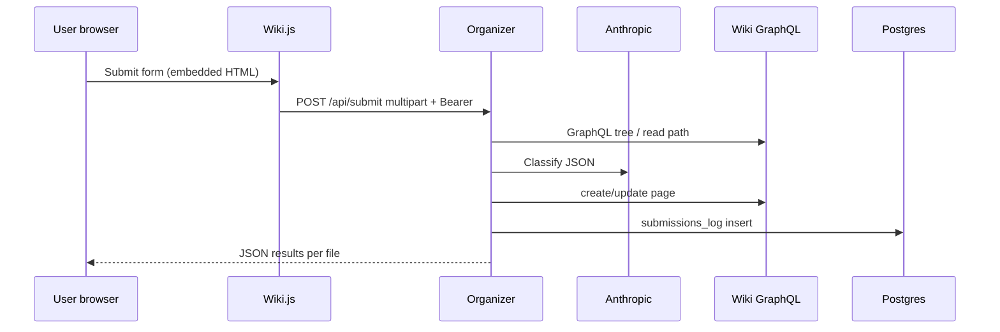
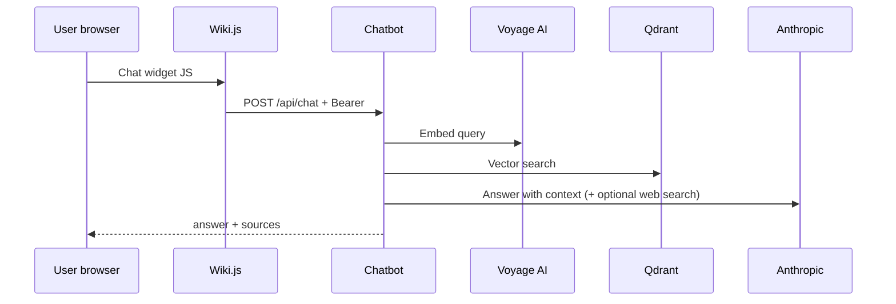
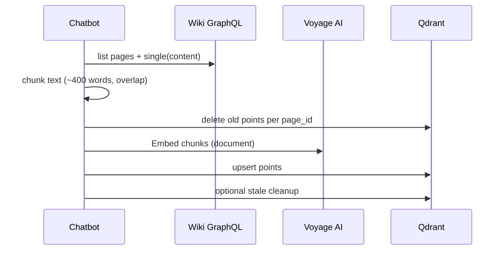

# SmartWiki architecture

## System context

SmartWiki is designed for **private** internal documentation:

- Users authenticate to **Wiki.js** (local accounts recommended).
- **Organizer** and **Chatbot** are internal APIs, protected by **API keys** (Bearer tokens).
- **Anthropic** and **Voyage AI** are external SaaS; no wiki content is stored in this git repo.

## Components

### Wiki.js (`wiki` service)

- **Port**: 3000 (mapped in Compose).
- **Data**: PostgreSQL (application tables) + `/wiki/data` volume for uploads/config.
- **GraphQL**: `/graphql` with `Authorization: Bearer <WIKIJS_API_TOKEN>`.
- **Key operations used**:
  - `pages.tree` / `pages.list` — directory context for the organizer.
  - `pages.singleByPath` / `pages.single` — read content for ingestion.
  - `pages.create` / `pages.update` — publish organized documents.

### PostgreSQL (`postgres` service)

- Holds Wiki.js schema (managed by Wiki.js).
- Additional table **`submissions_log`** (created by `docker/postgres/init.sql`) for audit:
  - who submitted, category/tags, AI JSON decision, target path, status, errors.

### Qdrant (`qdrant` service)

- Collection **`wiki_chunks`** (configurable): vector = Voyage embedding (default **1024** dims, cosine).
- Payload: `page_id`, `page_title`, `page_path`, `chunk_index`, `content` (chunk text).

### Organizer (`organizer` service)

- **FastAPI**, port 3001.
- **`POST /api/submit`**: multipart form — `title`, `category`, `tags`, `description`, `username`, one or more `files`.
- Flow per file:
  1. Parse text (`file_parser.py`) — `.md`, `.txt`, `.docx`, `.pdf`.
  2. Load wiki tree text (`wikijs_api.py`).
  3. **Claude** returns strict JSON: `targetPath`, `pageTitle`, `suggestedTags`, `summary`.
  4. Build markdown page body (summary + original text).
  5. **Create** or **update** wiki page via GraphQL.
  6. **Insert** row into `submissions_log`.

### Chatbot (`chatbot` service)

- **FastAPI**, port 3002.
- **`POST /api/chat`**: JSON `{ "question", "history" }` — rate-limited per client IP (SlowAPI).
- Flow:
  1. Embed question with **Voyage** (`input_type=query`).
  2. **Qdrant** top-K similarity search.
  3. **Claude** with system prompt + wiki context; **web search** tool enabled when the API accepts it (falls back without tools on error).
  4. Response: `{ "answer", "sources": [{ title, path, url }] }` (wiki sources from RAG hits).

- **`POST /api/ingest`**: full re-index of wiki pages into Qdrant (admin trigger).
- **Scheduler**: after initial ingest on startup, repeats every `INGEST_INTERVAL_SECONDS` (default 6h).

## Data flows

### Document submission

### Chat (RAG)

### Ingestion

## Security model

- **No anonymous access** to organizer/chatbot APIs (Bearer required).
- **Wiki.js** must be configured with **guest denied** and group rules per your org.
- **API keys** in HTML/JS are a **trade-off**; production should prefer **same-origin reverse proxy** that injects `Authorization` server-side (see `docs/DEPLOYMENT.md`).
- **CORS** is restricted to `CORS_ORIGINS` / `WIKI_PUBLIC_URL` in Compose.

## Technology choices

| Choice | Rationale |
|--------|-----------|
| Wiki.js 2.x | Stable; 3.x still maturing for many production policies |
| FastAPI | Async-friendly, clear OpenAPI, easy Docker |
| Qdrant | Dedicated vector DB; Cloud Run / managed options on GCP |
| Voyage AI | Documented embedding partner; voyage-4 default 1024-dim |
| Claude | Strong reasoning for classification + RAG answers |

## Related docs

- [DEPLOYMENT.md](DEPLOYMENT.md)
- [ENHANCEMENT-CLOUDRUN.md](ENHANCEMENT-CLOUDRUN.md)
- [ENHANCEMENT-REACT.md](ENHANCEMENT-REACT.md)
